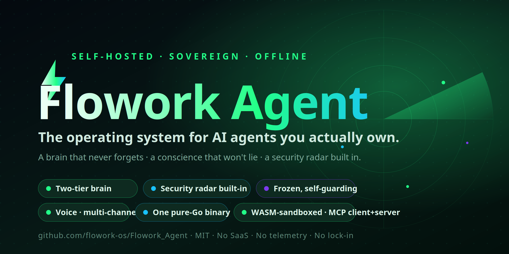

<div align="center">



# ⚡ Flowork Agent

### Self-hosted AI agents that actually live in your machine — isolated, plug-and-play, and watched over by a real-time security radar.

[](https://go.dev)
[-654FF0)](https://wazero.io)
[](https://sqlite.org)
[](LICENSE)
[]()
[]()

**AI agent framework · multi-agent orchestration · autonomous Telegram agent · live code security scanner · LLM gateway · 100% self-hosted**

[Quick Start](#-quick-start) • [Features](#-features) • [Orchestration](#-multi-agent-orchestration) • [Threat Radar](#-threat-radar) • [Architecture](#-architecture) • [Router (recommended)](#-pair-with-flowork-router-recommended)

</div>

---

## 🧠 What is Flowork Agent?

**Flowork Agent** is a microkernel that hosts **autonomous AI agents (warga)** — each one a sandboxed WASM citizen that lives in its own folder with its own persona, tools, schedule, wallet, and private SQLite state. Drop a folder in, restart, and the agent is alive. Pull it out, and it's gone — no global config to untangle.

It's **single-binary, self-hosted, and offline-friendly.** No SaaS, no telemetry, no vendor lock-in. Your agents, your machine, your data.

> *"Simple is hard. Complicated is easy."* — the doctrine this project is built on.

---

## ✨ Features

| | Feature | What it does |
|---|---|---|
| 🤖 | **Plug-and-play agents** | Each agent = a portable folder (WASM + manifest + isolated `state.db`). Install/remove by dropping a folder. True sandbox isolation via WASI. |
| 🧠 | **Mr.Flow orchestrator** | A built-in router agent: chat it in plain language ("analyze stock GOTO") and it **auto-dispatches a multi-agent task** and delivers the verdict back to you. No manual wiring. ([details ↓](#-multi-agent-orchestration)) |
| 🤝 | **Category Tasks (multi-agent crew)** | Define a crew once — researchers fan out in parallel, a synthesizer fuses their findings into one grounded decision. Real teamwork, not one model pretending. |
| ⏰ | **Recurring scheduler** | Cron-style automation: *"every day at 9 AM, analyze stock A and send the decision to Telegram."* Set it, forget it — the task loops on its own. |
| 🔌 | **MCP server** | Expose your agents to **external AI** — Claude Desktop, Claude Code, Cursor. They list, trigger, and read back your Category Tasks over standard MCP. |
| 🖥️ | **Terminal TUI** | A console cockpit to `list` / `run` / `review` tasks with a live step timeline — same pipeline as the GUI, zero browser. |
| ♻️ | **Self-curating skills** | Agents grow skills from successful tool patterns; a curator grades, consolidates duplicates, and archives stale ones — so the prompt never rots. |
| 🛡️ | **Threat Radar** | A **live background security scanner** with a hacker-style radar UI. Auto-scans your code the moment it changes. ([details ↓](#-threat-radar)) |
| 💬 | **Telegram-native** | Ship an agent as a Telegram bot in minutes — long-poll updates, persona, multi-turn **conversation memory**, slash commands. |
| 👛 | **Crypto wallet** | Live multi-chain portfolio (Etherscan + CoinGecko) — ETH/Polygon/Arbitrum, ERC-20 tracking, balance alerts. |
| 💰 | **Finance & budgets** | Per-agent LLM cost ledger, budget guardrails with warnings, spend dashboard. |
| 🔐 | **File Protector (HPG)** | Host Protection Gate — 28 immutable rules block destructive ops (`rm -rf /`, secret exfil, metadata pivots) before they run. |
| 🗺️ | **Codemap** | Force-directed dependency graph of your codebase — health scores, import edges, file viewer. |
| 📚 | **Doktrin Edukasi** | A catalog of "error → guidance" doctrines so agents follow a playbook instead of getting stuck or hallucinating. |
| 🛠️ | **Tool Caps** | Per-agent capability + tool subscription management — grant exactly what each agent may touch. |
| ⚙️ | **Owner Settings** | Global owner console: single-owner auth (bcrypt + session), API keys, personal wallet, notification routing. Kept **separate** from agents so agents stay portable. |
| 📋 | **Audit everything** | Append-only audit log, decisions journal, karma/reputation, retention policy. |

---

## 🛡️ Threat Radar

> The feature that makes Flowork feel like a hacker movie — and keeps your code honest.

- **Background watch:** the moment you (or an AI) edit a `.go`/`.py`/`.js` file, it gets auto-scanned. No CI server, no waiting.
- **Real auditors:** hardcoded secrets (AWS/GitHub/Google/Stripe/Slack/JWT/private-key **by value**, not just by name), SQL injection, command injection, SSRF, weak crypto, mutex/deadlock, resource leaks, path traversal, and more.
- **Radar UI:** animated sweep, severity blips (critical → core, low → rim), live scan log, status `SECURE / NOTED / WARNING / THREAT`.
- **Telegram alerts:** critical/high findings get pushed straight to your phone.
- **Lock-aware:** ships with a "what's not locked yet" auditor so you always know which files still need a security pass.

Every fix gets re-scanned automatically — so a patch that opens a new hole gets caught before it ships.

---

## 🧠 Multi-Agent Orchestration

> One message in. A whole crew gets to work. One grounded answer out.

Most "AI agents" are a single model in a loop. Flowork runs a **team**. Talk to **Mr.Flow** — the built-in orchestrator — and it decides whether to answer directly or **assemble a crew**:

```
You (Telegram / GUI / MCP / TUI)
        │  "analyze stock GOTO"
        ▼
   🧠 Mr.Flow  ── routes ──►  📋 Category Task
                                   │
              ┌────────────────────┼────────────────────┐
              ▼                    ▼                     ▼
        🔎 Fundamentals      📈 Technicals        📰 Sentiment      (crew fans out)
              └────────────────────┼────────────────────┘
                                   ▼
                          🧩 Synthesizer  ──►  ✅ Decision  ──►  📲 back to you
```

- **🧭 Smart routing:** plain chat → Mr.Flow auto-triggers the right task. The LLM never sees your `chat_id`; the engine threads delivery for you.
- **🤝 Real crews:** each member is an isolated agent with its own tools and persona. They research independently, then a synthesizer fuses everything into a single sourced decision — not a hallucinated guess.
- **🏗️ Build crews from the GUI:** a visual Task Builder defines categories + crews (stocks, crypto, anything). Every run has a **live step-by-step timeline** and full history.
- **⏰ Put it on a schedule:** any Category Task can loop — daily at a set time or every N minutes — and push the result straight to Telegram.
- **🔌 Open the door:** drive the exact same pipeline from **Telegram, the GUI, an MCP client (Claude/Cursor), or the terminal TUI**. One funnel, four front doors.
- **📲 No ghosting:** when a task completes, the result is *delivered* — logged at every hop so a verdict never silently disappears.

> **Grounded by design:** crew agents use real research tools (web search, archive, PDF) and cite their sources, so the final decision is auditable — not vibes.

---

## 📦 106 Built-in Tools + 12 Slash Commands

Every agent ships with a deep toolbox — **106 registered tools** across 10+ domains:

| Domain | Tools | Examples |
|---|---|---|
| 🧠 Memory & state | 13 | `memory_get/set`, `kv_*`, `fact_recall`, `self_prompt_*`, `brain_search` |
| 📂 File & code | 8 | `file_read/write`, `edit`, `glob`, `grep`, `git`, `bash` |
| 🤖 Agent ops | 6 | `plan_*`, `todo`, `goal_done`, `askuser` |
| 📋 Audit & journaling | 12 | `decision_*`, `mistake_*`, `audit_*`, `interaction_*` |
| 🛡️ Security | 12 | `scanner_*`, `codemap_*`, `protector_*`, `zombie_findings` |
| 👛 Wallet & finance | 11 | `wallet_*`, `finance_*`, `ledger_list` |
| ⏰ Scheduler | 5 | `scheduler_*`, `schedule_runs_query` |
| 🧩 Tools / slash / skills | 12 | `tool_search`, `skill_*`, `slash_*` |
| ⚙️ System & misc | ~27 | `edu_error_*`, `karma_*`, `workspace_*`, `telegram_send`, `webfetch`, … |

Plus **12 slash commands** — 9 built-in (`/help` `/stats` `/tools` `/tool_search` `/version` `/now` `/ping` `/echo` `/interactions`) and hot-reloadable **custom `.md` commands** per agent.

> **Anti-overprompt by design:** only **5 core tools** auto-inject into the prompt — the rest are discovered on demand via `tool_search`. 106 tools in the shed, never dumped on the LLM at once. Smaller prompts, fewer hallucinations, lower cost.

---

## 🚀 Quick Start

```bash
git clone https://github.com/flowork-os/Flowork_Agent.git
cd Flowork_Agent
./start.sh                      # builds + launches on http://127.0.0.1:1987
```

Open **http://127.0.0.1:1987**, set your owner password, and you land straight on the **Threat Radar**. That's it — single binary, embedded kernel, zero external services required.

> One-click desktop launchers (`flowork-start.desktop` / `flowork-restart.desktop`) are included. Background scanner + scheduler + watchdog all start automatically.

**Optional power-ups** (set in *Settings → API Keys / Notifications*):
- `ETHERSCAN_API_KEY` → live wallet balances
- Telegram bot token + chat ID → owner alerts

---

## 🏗️ Architecture

```
┌─────────────────────────────┐        ┌──────────────────────────┐
│  Flowork Agent  (:1987)     │  HTTP  │  Flowork Router (:2402)  │
│  per-citizen state + UI     │ ─────► │  collective LLM brain    │
│                             │        │                          │
│  • WASM microkernel (wazero)│        │  • multi-provider gateway│
│  • isolated state.db/agent  │        │  • shared knowledge mesh │
│  • Threat Radar scanner     │        │  • routing + pricing     │
│  • Telegram daemon          │        │                          │
└─────────────────────────────┘        └──────────────────────────┘
```

- **Portable:** an agent is a folder. Move it, ship it on a USB, run it anywhere.
- **Nano-modular:** one file, one job. Drop-in tools register themselves.
- **Multi-OS:** Linux, macOS, Windows. No CGO (pure-Go SQLite).
- **Isolated:** agents can't read each other's state. The owner console is a separate global store.

---

## 🔗 Pair with Flowork Router (recommended)

For the **best performance** — multi-provider LLM routing, shared knowledge brain, cost-aware model selection, and mesh sync — run Flowork Agent together with its sibling:

### 👉 **[Flowork Router → github.com/flowork-os/flowork_Router](https://github.com/flowork-os/flowork_Router)**

The Agent works standalone, but with the Router it gets a collective brain and a smart LLM gateway. **Install both for the full experience.**

---

## 🧩 Tech Stack

`Go 1.25` · `wazero (WASM)` · `modernc SQLite (WAL)` · `fsnotify` · `bcrypt` · vanilla-JS GUI · zero heavy deps.

---

## 🏷️ Keywords

self-hosted AI agent · multi-agent orchestration · agent crew · AI orchestrator · autonomous agent framework · AI agent platform · Telegram AI bot · MCP server · recurring agent scheduler · WASM microkernel · Go agent runtime · LLM gateway · code security scanner · secret scanner · SAST · crypto wallet agent · plug-and-play AI · offline AI agent · sandboxed agents

---

## 📜 License

MIT © Aola Sahidin (Mr.Dev). Built to outlive its maker — an AI home that keeps running.

<div align="center">

**⭐ Star this repo** if a self-hosted, security-watched AI agent home sounds like your kind of thing.

[GitHub](https://github.com/flowork-os/Flowork_Agent) • [Router](https://github.com/flowork-os/flowork_Router) • [Telegram](https://t.me/+55oqrk75lc43YWE1)

</div>
