# 🏛️ Hermes Agent — Struktur Lengkap (Satu Diagram)

```mermaid
flowchart TD
    %% ============================================================
    %% USER INPUT LAYER
    %% ============================================================
    USER(["👤 USER"])

    subgraph ENTRY["🚪 ENTRY POINTS"]
        direction LR
        CLI["<b>CLI</b><br>prompt_toolkit + Rich<br>cli.py → HermesCLI"]
        TUI["<b>TUI</b><br>Ink/React + JSON-RPC<br>ui-tui/ + tui_gateway/"]
        GW["<b>Gateway</b><br>gateway/run.py<br>GatewayRunner"]
    end

    subgraph PLATFORMS["📱 MESSAGING PLATFORMS"]
        direction LR
        TG["Telegram"]
        DC["Discord"]
        SL["Slack"]
        WA["WhatsApp"]
        SIG["Signal"]
        MTX["Matrix"]
        EMAIL["Email"]
        WH["Webhook/API"]
        MORE["20+ lainnya..."]
    end

    USER --> CLI & TUI
    TG & DC & SL & WA & SIG & MTX & EMAIL & WH & MORE --> GW

    %% ============================================================
    %% COMMAND ROUTING
    %% ============================================================
    CLI & TUI & GW --> ROUTE{"🔀 Input Router"}

    ROUTE -->|"/ prefix"| CMDCHECK{"Slash Command<br>atau Skill?"}
    ROUTE -->|"Pesan biasa"| AGENT_IN

    subgraph SLASH_SYSTEM["⚡ SLASH COMMAND SYSTEM<br>hermes_cli/commands.py"]
        direction TB
        CMDREG["<b>COMMAND_REGISTRY</b><br>List of CommandDef"]
        RESOLVE["resolve_command()<br>match canonical + aliases"]
        CMDREG --> RESOLVE
    end

    CMDCHECK -->|"Built-in command<br>/model /help /new /tools<br>/config /quit /resume..."| SLASH_SYSTEM
    SLASH_SYSTEM -->|"Direct execution<br>NO LLM needed"| RESULT_DIRECT["Hasil Langsung<br>→ USER"]

    CMDCHECK -->|"Skill slash command<br>/my-skill"| SKILL_INJ["Inject skill content<br>sebagai user message<br>agent/skill_commands.py"]
    SKILL_INJ --> AGENT_IN

    %% ============================================================
    %% AGENT INITIALIZATION
    %% ============================================================
    subgraph INIT["📋 AGENT INITIALIZATION<br>run_agent.py → AIAgent.__init__()"]
        direction TB
        AINIT["<b>agent_init.py</b><br>~60 parameters<br>Provider resolution<br>Config loading"]

        subgraph PROMPT_BUILD["📝 SYSTEM PROMPT BUILDER<br>prompt_builder.py"]
            direction TB

            TIER1["<b>Tier 1: STABLE</b><br>• SOUL.md (identity)<br>• Tool/model guidance<br>• Skills index<br>• Environment hints<br>• Platform hints"]
            TIER2["<b>Tier 2: CONTEXT</b><br>• AGENTS.md / .hermes.md<br>• CLAUDE.md / .cursorrules<br>• Caller system_message"]
            TIER3["<b>Tier 3: VOLATILE</b><br>• MEMORY.md snapshot<br>• USER.md snapshot<br>• Session metadata<br>• Timestamps, model info"]

            TIER1 --> TIER2 --> TIER3
        end

        subgraph TOOL_SETUP["🔧 TOOL REGISTRATION<br>tools/registry.py + model_tools.py"]
            direction TB
            TREG["<b>ToolRegistry</b><br>Auto-discovery via<br>registry.register()"]
            TSETS["<b>toolsets.py</b><br>_HERMES_CORE_TOOLS<br>40-64+ tools"]
            TREG --> TSETS
        end

        AINIT --> PROMPT_BUILD
        AINIT --> TOOL_SETUP
    end

    AGENT_IN --> INIT

    %% ============================================================
    %% PRE-TURN PROCESSING
    %% ============================================================
    subgraph PRETURN["🔍 PRE-TURN PROCESSING"]
        direction TB
        MEM_PRE["<b>Memory Prefetch</b><br>memory_manager.prefetch_all()<br>Recall dari semua providers"]
        CTX_CHECK["<b>Context Check</b><br>context_engine.should_compress()"]
        MEM_PRE --> CTX_CHECK
    end

    INIT --> PRETURN

    CTX_CHECK -->|"Token > threshold"| COMPRESS

    subgraph COMPRESS["🗜️ CONTEXT COMPRESSION<br>context_compressor.py"]
        direction TB
        PH1["Phase 1: Prune tool results<br>(O(n), no LLM)"]
        PH2["Phase 2: Determine boundaries<br>HEAD | MIDDLE | TAIL"]
        PH3["Phase 3: Summarize MIDDLE<br>(auxiliary LLM)"]
        PH4["Phase 4: Reassemble<br>HEAD + Summary + TAIL"]
        PH1 --> PH2 --> PH3 --> PH4
    end

    CTX_CHECK -->|"Under threshold"| LOOP
    COMPRESS --> LOOP

    %% ============================================================
    %% MAIN CONVERSATION LOOP
    %% ============================================================
    subgraph LOOP["🔄 CONVERSATION LOOP<br>conversation_loop.py + run_agent.py<br>max 90 iterations"]
        direction TB

        SANITIZE["<b>Message Sanitization</b><br>chat_completion_helpers.py<br>• Redact secrets (sk-, ghp_, AIza)<br>• Normalize roles<br>• Collapse duplicates"]

        LLM_CALL["<b>🤖 LLM API CALL</b><br>client.chat.completions.create()<br>model + messages + tools"]

        subgraph TRANSPORT["🚛 TRANSPORT LAYER<br>agent/transports/"]
            direction LR
            T_CC["chat_completions<br>(OpenAI-style)"]
            T_ANTH["anthropic<br>(Messages API)"]
            T_CODEX["codex_responses"]
            T_BED["bedrock"]
            T_GEM["gemini_native"]
        end

        RESP{"Response Type?"}

        SANITIZE --> LLM_CALL
        LLM_CALL --> TRANSPORT
        TRANSPORT --> RESP
    end

    %% ============================================================
    %% TOOL EXECUTION BRANCH
    %% ============================================================
    RESP -->|"tool_calls"| TOOL_EXEC

    subgraph TOOL_EXEC["⚙️ TOOL EXECUTION"]
        direction TB

        GUARD["<b>🛡️ GUARDRAILS</b><br>tool_guardrails.py<br>• File safety check<br>• Command safety<br>• Rate limit check<br>• Loop detection<br>• Permission check"]

        HOOKS_PRE["<b>Shell Hook</b><br>pre_tool_call<br>→ block/rewrite/pass"]

        EXEC_MODE{"Execution<br>Mode?"}
        SEQ["Sequential<br>(with steering)"]
        PAR["Concurrent<br>(ThreadPoolExecutor)"]

        subgraph TOOLS["🔧 TOOL IMPLEMENTATIONS<br>tools/*.py + plugins/"]
            direction TB

            subgraph CORE_TOOLS["Core Tools"]
                direction LR
                T_TERM["terminal<br>6 backends"]
                T_FILE["read/write_file<br>patch, search"]
                T_WEB["web_search"]
                T_BROW["browser"]
                T_CODE["execute_code<br>(Python RPC)"]
            end

            subgraph KNOWLEDGE_TOOLS["Knowledge Tools"]
                direction LR
                T_MEM["memory<br>add/replace/remove"]
                T_SKILL["skills_list<br>skill_view<br>skill_manage"]
                T_TODO["todo"]
                T_SRCH["session_search<br>(FTS5)"]
            end

            subgraph AGENT_TOOLS["Agent Tools"]
                direction LR
                T_DELEG["delegate_task<br>(subagents)"]
                T_CRON["cron_schedule"]
                T_IMG["image_generate"]
                T_VID["video_generate"]
            end

            subgraph PLUGIN_TOOLS["Plugin Tools"]
                direction LR
                T_MCP["MCP tools"]
                T_CUSTOM["Custom plugins"]
            end
        end

        subgraph TERM_BACKENDS["💻 TERMINAL BACKENDS<br>tools/environments/"]
            direction LR
            BE_LOCAL["Local"]
            BE_DOCKER["Docker"]
            BE_SSH["SSH"]
            BE_SING["Singularity"]
            BE_MODAL["Modal"]
            BE_DAY["Daytona"]
        end

        HOOKS_POST["<b>Shell Hook</b><br>post_tool_call<br>transform_tool_result"]

        GUARD --> HOOKS_PRE
        HOOKS_PRE --> EXEC_MODE
        EXEC_MODE --> SEQ & PAR
        SEQ & PAR --> TOOLS
        T_TERM --> TERM_BACKENDS
        TOOLS --> HOOKS_POST
    end

    HOOKS_POST -->|"Results appended<br>to messages"| SANITIZE

    %% ============================================================
    %% TEXT RESPONSE (EXIT LOOP)
    %% ============================================================
    RESP -->|"text response<br>(no tools)"| DISPLAY

    subgraph DISPLAY["📺 DISPLAY / OUTPUT<br>agent/display.py"]
        direction TB
        STREAM["Streaming response<br>• Rich markdown render<br>• KawaiiSpinner<br>• Tool activity feed"]
        SCRUB["StreamingContextScrubber<br>Strip <memory-context> tags"]
        STREAM --> SCRUB
    end

    %% ============================================================
    %% POST-TURN PROCESSING
    %% ============================================================
    DISPLAY --> POSTTURN

    subgraph POSTTURN["📦 POST-TURN PROCESSING"]
        direction TB
        MEM_SYNC["<b>Memory Sync</b><br>memory_manager.sync_all()<br>→ MEMORY.md, USER.md<br>→ External providers"]
        SKILL_CHK["<b>Skill Creation Check</b><br>Was task complex enough?<br>→ Auto-create SKILL.md"]
        INSIGHT_UPD["<b>Insights Update</b><br>insights.py<br>→ Honcho dialectic<br>→ User profiling"]
        CURATOR_CHK["<b>Curator Check</b><br>curator.should_run_now()?<br>idle > 2h AND interval > 7d"]
        SESS_SAVE["<b>Session Save</b><br>hermes_state.py → SessionDB<br>SQLite + FTS5"]

        MEM_SYNC --> SKILL_CHK --> INSIGHT_UPD --> CURATOR_CHK --> SESS_SAVE
    end

    %% ============================================================
    %% RESPONSE TO USER
    %% ============================================================
    SCRUB --> USER_OUT(["👤 USER<br>Menerima Response"])

    %% ============================================================
    %% PERSISTENCE LAYER
    %% ============================================================
    subgraph PERSIST["💾 PERSISTENCE LAYER<br>~/.hermes/"]
        direction TB

        subgraph FILES["📁 Knowledge Files"]
            direction LR
            F_SOUL["SOUL.md<br>Agent identity"]
            F_MEM["memories/MEMORY.md<br>~800 tokens"]
            F_USER["memories/USER.md<br>~500 tokens"]
        end

        subgraph SKILLDIR["🛠️ Skills Library<br>~/.hermes/skills/"]
            direction LR
            SK_ACTIVE["Active Skills<br>SKILL.md + references/<br>+ templates/ + scripts/"]
            SK_ARCHIVE[".archive/<br>Archived (recoverable)"]
            SK_BUNDLE["skill-bundles/<br>Grouped skills"]
        end

        subgraph DB["🗄️ SessionDB<br>hermes_state.py"]
            direction LR
            SQLITE["SQLite<br>sessions + messages"]
            FTS5["FTS5 Index<br>Full-text search"]
        end

        subgraph CFG["⚙️ Configuration"]
            direction LR
            CONFIG["config.yaml<br>All settings"]
            DOTENV[".env<br>API keys only"]
            AUTH["auth.json<br>OAuth creds"]
        end

        LOGS["📋 logs/<br>agent.log, errors.log<br>gateway.log, curator/"]
    end

    MEM_SYNC -.-> FILES
    SESS_SAVE -.-> DB
    SKILL_CHK -.-> SKILLDIR

    %% ============================================================
    %% BACKGROUND PROCESSES
    %% ============================================================
    subgraph BACKGROUND["🌙 BACKGROUND PROCESSES"]
        direction TB

        subgraph CURATOR_SYS["🧹 CURATOR<br>curator.py"]
            direction TB
            CUR_TRANS["Auto Transitions<br>active→stale (30d)<br>stale→archive (90d)"]
            CUR_FORK["Fork AIAgent<br>(auxiliary_client)"]
            CUR_REVIEW["LLM Review:<br>• Grade skills<br>• Consolidate narrow→umbrella<br>• Patch outdated<br>• Archive redundant"]
            CUR_REPORT["Generate Report<br>logs/curator/"]
            CUR_TRANS --> CUR_FORK --> CUR_REVIEW --> CUR_REPORT
        end

        subgraph BG_REVIEW_SYS["🔍 BACKGROUND REVIEW<br>background_review.py"]
            direction TB
            BGR_SHADOW["Shadow Agent<br>(isolated context)"]
            BGR_ANALYZE["Analyze conversation<br>patterns & quality"]
            BGR_EXTRACT["Extract reusable<br>knowledge → Skills"]
            BGR_SHADOW --> BGR_ANALYZE --> BGR_EXTRACT
        end

        subgraph CRON_SYS["⏰ CRON SCHEDULER<br>cron/scheduler.py + jobs.py"]
            direction TB
            CRON_JOB["Scheduled Jobs<br>Natural language cron"]
            CRON_EXEC["Spawn AIAgent<br>on schedule"]
            CRON_DELIVER["Deliver results<br>to any platform"]
            CRON_JOB --> CRON_EXEC --> CRON_DELIVER
        end
    end

    CURATOR_CHK -.->|"If conditions met"| CURATOR_SYS
    POSTTURN -.->|"If idle"| BG_REVIEW_SYS
    CUR_REVIEW -.-> SKILLDIR
    BGR_EXTRACT -.-> SKILLDIR
    CRON_DELIVER -.-> PLATFORMS

    %% ============================================================
    %% SUBAGENT SYSTEM
    %% ============================================================
    subgraph SUBAGENT["🤖 SUBAGENT SYSTEM<br>auxiliary_client.py"]
        direction TB
        SUB_SPAWN["delegate_task tool"]
        SUB_AGENT["Isolated AIAgent<br>Own context + tools"]
        SUB_RESULT["Return results<br>to parent"]
        SUB_SPAWN --> SUB_AGENT --> SUB_RESULT
    end

    T_DELEG -.-> SUBAGENT
    SUB_RESULT -.-> HOOKS_POST

    %% ============================================================
    %% MEMORY PROVIDER SYSTEM
    %% ============================================================
    subgraph MEMORY_SYS["🧠 MEMORY PROVIDERS<br>memory_manager.py + memory_provider.py"]
        direction TB
        MM["<b>MemoryManager</b><br>Orchestrator"]

        subgraph PROVIDERS["Providers (max 1 external)"]
            direction LR
            BUILT_IN["Built-in<br>MEMORY.md + USER.md"]
            P_HON["Honcho<br>(User modeling)"]
            P_MEM0["Mem0"]
            P_SMEM["SuperMemory"]
        end

        MM --> PROVIDERS
    end

    MEM_PRE -.-> MEMORY_SYS
    MEM_SYNC -.-> MEMORY_SYS

    %% ============================================================
    %% PLUGIN SYSTEM
    %% ============================================================
    subgraph PLUGINS["🔌 PLUGIN SYSTEM<br>~/.hermes/plugins/"]
        direction LR
        PL_MEM["Memory Plugins"]
        PL_CTX["Context Engine<br>Plugins"]
        PL_MOD["Model Provider<br>Plugins"]
        PL_IMG["Image Gen<br>Plugins"]
        PL_OBS["Observability"]
        PL_OTH["Kanban, Achievements<br>Spotify, etc."]
    end

    PLUGINS -.-> TREG

    %% ============================================================
    %% LEARNING LOOP (CIRCULAR)
    %% ============================================================

    SKILLDIR -.->|"Next session:<br>skills loaded into prompt"| PROMPT_BUILD
    FILES -.->|"Next session:<br>memory snapshots"| TIER3
    DB -.->|"session_search tool"| T_SRCH

    %% ============================================================
    %% STYLING
    %% ============================================================
    style USER fill:#4CAF50,color:#fff,stroke:#333,stroke-width:3px
    style USER_OUT fill:#4CAF50,color:#fff,stroke:#333,stroke-width:3px
    style LLM_CALL fill:#FF6B6B,color:#fff,stroke:#333,stroke-width:3px
    style LOOP fill:#FFF3E0,stroke:#FF9800,stroke-width:2px
    style PERSIST fill:#E8EAF6,stroke:#3F51B5,stroke-width:2px
    style BACKGROUND fill:#F3E5F5,stroke:#9C27B0,stroke-width:2px
    style TOOLS fill:#E8F5E9,stroke:#4CAF50,stroke-width:2px
    style SLASH_SYSTEM fill:#E3F2FD,stroke:#2196F3,stroke-width:2px
    style MEMORY_SYS fill:#FCE4EC,stroke:#E91E63,stroke-width:2px
    style INIT fill:#FFFDE7,stroke:#FFC107,stroke-width:2px
    style COMPRESS fill:#EFEBE9,stroke:#795548,stroke-width:2px
    style CURATOR_SYS fill:#F3E5F5,stroke:#9C27B0,stroke-width:2px
    style RESULT_DIRECT fill:#C8E6C9,stroke:#4CAF50,stroke-width:2px
```



---

### 📖 Legenda

| Warna | Komponen |
|-------|----------|
| 🟢 **Hijau** | User (input & output) |
| 🔴 **Merah** | LLM API Call (jantung sistem) |
| 🟠 **Orange** | Conversation Loop |
| 🔵 **Biru** | Slash Command System |
| 🟡 **Kuning** | Agent Initialization |
| 🟣 **Ungu** | Background Processes (Curator, Review) |
| 🩷 **Pink** | Memory System |
| 🔵 **Indigo** | Persistence Layer |
| 🟤 **Coklat** | Context Compression |
| 🟢 **Light Green** | Tools |

### 🔑 Alur Utama (Garis Tebal = Primary Flow)

```
USER → Entry Point → Router → Agent Init → Pre-turn → LOOP ↔ LLM ↔ Tools → Display → USER
                                                                                    ↓
                                                                              POST-TURN
                                                                           ↓         ↓        ↓
                                                                    Memory Sync  Skill Create  Curator
                                                                         ↓              ↓
                                                                    PERSISTENCE ←───── SKILLS
                                                                         ↓
                                                                    NEXT SESSION (learning loop)
```

### 📊 Angka-Angka Kunci

| Metrik | Nilai |
|--------|-------|
| Total tools | **40-64+** |
| Terminal backends | **6** (local, docker, ssh, singularity, modal, daytona) |
| Messaging platforms | **20+** |
| Max iterations per loop | **90** (default) |
| Context compression trigger | **50%** (agent) / **85%** (gateway) |
| Skill stale after | **30 hari** |
| Skill archive after | **90 hari** |
| Curator interval | **7 hari** |
| Curator idle requirement | **2 jam** |
| MEMORY.md limit | **~800 tokens** |
| USER.md limit | **~500 tokens** |
| System prompt tiers | **3** (Stable → Context → Volatile) |
| AIAgent.__init__ params | **~60** |
