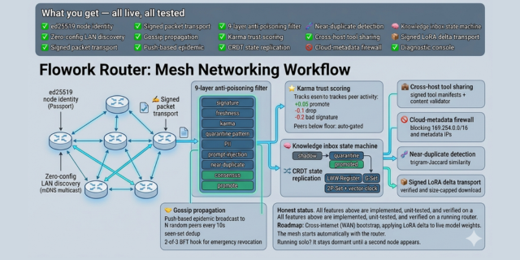

<div align="center">


# 🛣️ Flow Router

### Never hit a rate-limit again. Run Claude Code, Cursor & 40+ providers through the AI subscription you **already pay for** — and cut **40–80% of your tokens.**

**One OpenAI-compatible endpoint for every AI provider.** Auto-fallback so you never stop coding · **RTK token-saver** trims 40–80% off agent loops · **Cloak** keeps Claude OAuth un-banned · optional **P2P mesh** so your stack survives anything — even offline. All in **one Go binary**: no Docker, no Python, no database.

> Route Claude · GPT · Gemini · DeepSeek · Groq · Ollama · vLLM through `http://127.0.0.1:2402/v1`. Plug it into Claude Code, Cursor, Codex, Cline, **OpenClaw**, **Hermes** — anything that speaks OpenAI, Anthropic or Gemini.

A self-hosted alternative to **[LiteLLM](https://github.com/BerriAI/litellm) · [OpenRouter](https://openrouter.ai) · [9router](https://github.com/decolua/9router)** — but a single binary, with anti-ban cloaking + a sovereign mesh nobody else ships.

[](LICENSE)
[](https://go.dev)
[](#-quick-start)
[](#-quick-start)
[](#-tech--quality)

**[GitHub](https://github.com/flowork-os/flowork_Router)** · **[AI Agent companion →](https://github.com/flowork-os/Flowork_Agent)** · [Features](#-everything-it-does) · [Compare](#-flow-router-vs-litellm--openrouter--9router) · [Quick Start](#-quick-start) · [Mesh](#-sovereign-p2p-mesh) · [FAQ](#-faq) · [API](#-api-reference)

</div>

> 🤖 **Works with ANY OpenAI-compatible agent** — Claude Code, Cursor, Cline, Codex, Continue, Aider, **Hermes**, **OpenClaw**, custom apps. For the deepest integration (thin-body remote-brain, caretaker pipeline, purpose-built subagents) pair it with the recommended companion: **[github.com/flowork-os/Flowork_Agent](https://github.com/flowork-os/Flowork_Agent)**.
>
> **One brain (this router) + many bodies (any agent) = your full sovereign AI stack.**

---

## Why Flow Router?

Modern AI workflows are fragmented. Every CLI, IDE and agent speaks a slightly different API. Every provider bills differently. Your paid subscriptions sit idle while you burn API credits — and a single rate-limit kills your flow.

**Flow Router fixes all of it with one local endpoint:**

- 🔌 **One endpoint, every model.** Point any tool at `http://127.0.0.1:2402/v1` and reach Claude, GPT, Gemini, DeepSeek, Groq, local models — anything.
- 🔑 **Use what you already pay for.** Drive Claude Code / Cursor through your existing **Claude Pro/Max** subscription — no extra API key.
- 🥷 **Stay un-banned.** Claude OAuth requests are cloaked to look like a genuine Claude Code session — a faithful Go port of proven anti-ban logic.
- 🔁 **Never stop coding.** Priority → round-robin → cost-optimal fallback chains + a 17-rule cooldown/backoff table — one rate-limit just rolls to the next provider.
- 🕸️ **Survive anything.** Turn on the **P2P mesh** and routers replicate knowledge host-to-host — leaderless, internet-optional, self-defending.
- 🖥️ **Zero ops.** One Go binary. No runtime, no DB server. Runs on a Raspberry Pi.

---

## ⚖️ Flow Router vs LiteLLM / OpenRouter / 9router

| | **Flow Router** | LiteLLM | OpenRouter | 9router |
|---|:---:|:---:|:---:|:---:|
| **Deploy** | 🟢 single Go binary | Python + Docker | hosted SaaS | Node.js + Next.js |
| **No DB / runtime needed** | 🟢 | 🔴 | n/a | 🔴 |
| **Use your subscription (no API key)** | 🟢 Claude/Codex/Copilot/Cursor… | 🟡 keys | 🔴 | 🟢 |
| **Claude anti-ban cloaking** | 🟢 **Cloak** | 🔴 | 🔴 | 🟡 |
| **Token-saver** | 🟢 **RTK 40–80%** | 🔴 | 🔴 | 🟡 ~20–40% |
| **Auto-fallback chains** | 🟢 17-rule cooldown | 🟢 | 🟢 | 🟢 |
| **P2P mesh / offline-survivable** | 🟢 **sovereign mesh** | 🔴 | 🔴 | 🔴 |
| **Shared brain (RAG)** | 🟢 FTS5 Memory Palace | 🔴 | 🔴 | 🔴 |
| **Runs on a Raspberry Pi** | 🟢 | 🟡 | n/a | 🟡 |

> Same job as the popular gateways — **route every provider through one endpoint** — but Flow Router is the only one that's a single binary *and* ships anti-ban, a token-saver, and a self-defending P2P mesh. Your traffic, your machine, your rules.

---

## ✨ Everything it does

### 🧠 Gateway & translation
| | |
|---|---|
| 🔌 **Universal endpoint** | OpenAI `/v1/chat/completions` (+ streaming), Anthropic `/v1/messages`, OpenAI `/v1/responses`, Gemini `/v1beta/models` — all served at once |
| 🔄 **Full format translation** | Transparent OpenAI ⇄ Anthropic ⇄ Gemini conversion via a dual-hop `source → openai → target` registry — request, response **and** streaming SSE |
| 🛠️ **Tool-calling parity** | `tool_calls` ⇄ `tool_use` conversion (incl. streaming tool rounds); tool-id sanitisation + empty `tool_result` stubs prevent the most common Claude 400 |
| 🧩 **26 vendor executors** | Per-vendor wire-format backends: antigravity · azure · codex · commandcode · cursor (real ConnectRPC protobuf) · gemini-cli · github · grok-web · iflow · jetbrains · kiro · ollama · opencode · perplexity · qoder · qwen · vertex … |
| 📐 **Smart params** | 22-param OpenAI passthrough, max_tokens auto-bump for tools/thinking, reasoning-content injection, forced-stream collapse, Responses-API event streamer |

### 🥷 Subscription & anti-ban
| | |
|---|---|
| 🔑 **Subscription auth** | Drive workloads through **Claude Pro/Max**, Codex, GitHub Copilot, Cursor Pro, Kiro, JetBrains AI, Google Antigravity — no API key |
| 🥷 **Claude anti-ban cloaking** | Claude OAuth requests cloaked to mirror a real Claude Code session: client tools renamed `_cc` + 20 native decoy tools, synthetic `x-anthropic-billing-header`, CC-format fake `user_id`. Tool names restored in the response. Auto-off for API-key providers |
| 🪪 **OAuth & key import** | Connect Codex, Cursor, GitLab, iFlow, Kiro, Claude — or paste a token directly |
| 🧭 **Live quota fetchers** | Pull real upstream rate-limit windows for 13 providers (claude/copilot/codex/gemini/kiro/glm/minimax/qwen/iflow/…) |

### 🔁 Routing & resilience
| | |
|---|---|
| 🔁 **Smart fallback** | Priority-ordered providers; auto-retry the next on error/rate-limit |
| 🧩 **Combos** | Group models into one alias with priority / round-robin / random / cost-optimal strategies + per-model combo fallback |
| 💸 **Cost-tier routing** | Heuristic classifier (char count + code + tool_use + multi-turn) routes simple queries to cheap/local models, honours explicit picks |
| 🪃 **17-rule cooldown** | Rate-limit / quota / capacity / overloaded text + 401/402/403/404/429/5xx status rules, exponential backoff |
| ✂️ **RTK token-saver** | 11 auto-detected tool-output compressors (git-diff, grep, ls, tree…) — typical 40–80% token cut in agent loops |
| 🪨 **Caveman mode** | Appends a "respond tersely" instruction (lite/full/ultra) to save output tokens; code/paths/commands stay exact |

### 🧬 Shared brain (RAG)
| | |
|---|---|
| 🧬 **Server-side RAG** | FTS5 BM25 cascade over a Memory Palace — any agent that hits the endpoint gets the same retrieved knowledge + skills + persona |
| 🪞 **Compounding ingest** | Every interaction can be ingested back as FTS-indexed knowledge — all connected agents make the brain smarter together |
| 🛣️ **Thin / Pi body mode** | `FLOWORK_BRAIN_REMOTE` lets a light agent body run with no local brain DB — RAG via the router |
| 📦 **Prebuilt ~5M-drawer brain** | The ready-made Memory Palace behind the "5-million-memory" claim — [download from Google Drive](https://drive.google.com/drive/folders/18iD1iPVu5Yxdj3qJYuQbDJAgwoWAbY3Z?usp=sharing) (multi-GB, too large for GitHub) |

> **📦 Download the 5-million-drawer brain**
>
> The cover and diagram mention a **~5,000,000-memory brain** — that's a prebuilt **Memory Palace** (`flowork-brain.sqlite`, an FTS5 SQLite database) that feeds the *enrich* step before every LLM call. It's **several GB**, far over GitHub's file-size limit, so it can't live in this repo. It's hosted on Google Drive instead:
>
> **➡️ [Download the prebuilt brain (Google Drive)](https://drive.google.com/drive/folders/18iD1iPVu5Yxdj3qJYuQbDJAgwoWAbY3Z?usp=sharing)** &nbsp;·&nbsp; *upload still in progress — sizes/files appear as they finish*
>
> **Install:** drop `flowork-brain.sqlite` at **`~/.flow_router/brain/flowork-brain.sqlite`** (the default), or put a `brain/` folder next to the binary for a fully portable build. The router auto-detects it on boot and starts enriching against it.
>
> **It's optional.** Without the prebuilt brain the router runs **100% normally** — it just starts with an empty Memory Palace that fills up on its own as you use it (every interaction can be ingested back as knowledge). The download is a head-start, not a dependency.
>
> 📖 Details: [`brain/README.md`](brain/README.md) · run a fully **local model** instead of a cloud provider: [`models/README.md`](models/README.md) (recommended GGUF/Ollama models).

### 🛡️ Infra & ops
| | |
|---|---|
| 📊 **Usage analytics** | Per-day charts, per-provider breakdown, live request stream, cost estimates |
| 🛡️ **MITM inspector** | Capture, inspect & replay full request/response bodies; local TLS interception with per-SNI cert minting |
| 🚇 **Tunnels** | Expose securely via Cloudflare Tunnel or Tailscale, with a health watchdog |
| 🌐 **Edge proxy deploy** | Generate ready-to-ship proxy workers for Cloudflare, Deno Deploy, Vercel |
| 🎬 **Media providers** | Route embeddings, text-to-image, TTS, STT and web-fetch/search to dedicated backends |
| 🧠 **MCP registry** | Register Model Context Protocol servers + live tool discovery, behind a spawn allowlist |
| 🔐 **Optional login** | Password (argon2id) or OIDC, opt-in session enforcement, per-IP login rate limiter |
| 💾 **Backups + migrations** | Versioned `VACUUM INTO` snapshots + idempotent schema migrations with auto pre-snapshot |
| 🔒 **Secrets at rest** | Provider keys + OAuth tokens AES-256-GCM encrypted in SQLite |
| ⌨️ **CLI auto-config** | Detect & configure 13 popular AI CLIs/extensions in one click |

---

## 🔄 How it works

One OpenAI-compatible endpoint hides the whole pipeline: the router **enriches** your prompt with knowledge + anti-hallucination antibodies *before* the LLM, **routes** to the cheapest capable provider with auto-fallback, and lets a sovereign **mesh** grow the brain across your fleet.

<div align="center"></div>

---

## 🕸️ Sovereign P2P Mesh

<div align="center"></div>

Flow Router isn't just a single-box gateway. Turn on the **mesh** and every router becomes a sovereign node in a **leaderless, internet-optional, peer-to-peer brain network** — designed to keep your AI stack alive even if the cloud, the company, or the internet itself goes dark. No central server. No single point of failure. Your knowledge replicates host-to-host and **defends itself from hostile peers.**

```
   Router A  ◀──── signed packets (ed25519) ────▶  Router B
   :2402                                              :2402
     │  mDNS announce (224.0.0.251:5353)                │
     │  gossip push → 3 random peers / 10s              │
     ▼                                                  ▼
   ┌─────────────────────────────────────────────────────┐
   │  EVERY inbound knowledge packet runs the 9-layer      │
   │  gauntlet: signature · freshness · karma · quarantine │
   │  · PII · injection · near-dup · consensus · promote   │
   │     pass → promote + reward karma                     │
   │     flag → quarantine    reject → drop + penalise     │
   └─────────────────────────────────────────────────────┘
```

| Capability | What it does |
|---|---|
| 🪪 **ed25519 identity** | Each router self-generates a keypair on first boot — its sovereign passport. Private key never leaves the box |
| 📡 **Zero-config discovery** | Pure-Go mDNS multicast — routers find each other, no seed list, no config |
| ✍️ **Signed transport** | Every packet `ed25519(sha256(...))`-signed + dedup'd; tampered/replayed packets rejected at the door |
| 🤝 **Gossip propagation** | Push-based epidemic broadcast with seen-set dedup; 2-of-3 BFT hook for emergency revocation |
| 🛡️ **9-layer anti-poisoning** | Hostile peers can't silently inject knowledge — filter wired into the live receive path, not just a test endpoint |
| ⭐ **Karma trust** | Peers earn/lose trust; those below the floor are auto-gated out of discovery + gossip; daily decay |
| 🧬 **Near-dup detection** | Dependency-free trigram-Jaccard — rejects reworded copies, no embedding model, fully offline |
| 🔀 **CRDT replication** | G-Counter · LWW · G-Set · 2P-Set + vector-clock causal ordering — any merge order converges |
| 🚫 **Cloud-metadata firewall** | Discovery hard-blocks `169.254.0.0/16` + metadata IPs — mesh can't be tricked into an SSRF pivot |

> **Honest status:** discovery, identity, signed transport, gossip, the 9-layer filter, karma gating, near-dup, CRDT merge, tool-manifest + LoRA-delta validation are **implemented, unit-tested, and verified on a running router**. WAN bootstrap beyond LAN, and *applying* a LoRA delta to live weights (needs a fine-tuning runtime this binary doesn't ship), remain on the roadmap. We don't market what we haven't built.

---

## 🚀 Quick Start

```bash
# Build from source (Go 1.25+)
git clone https://github.com/flowork-os/flowork_Router.git
cd flowork_Router
go build -o flow-router-bin .
./flow-router-bin           # dashboard + API on http://127.0.0.1:2402
```

> 📖 **New here? Read the [handbook](docs/handbook/) first** — what it is, how to install, how it
> works, and every menu explained. Plain Markdown, readable right after you clone. Start with
> [Getting Started](docs/handbook/getting-started.md).

**Point any tool at it:**

```
Endpoint: http://127.0.0.1:2402/v1
API Key:  flr_...   (generate in the dashboard, or any string if auth is off)
```

**Connect a provider in 10 seconds:** open `http://127.0.0.1:2402` → **Providers** → pick a preset (Claude Pro/Max, OpenAI, Gemini, DeepSeek, Ollama…) → paste key or OAuth login → done.

```bash
# Sanity check
curl http://127.0.0.1:2402/v1/chat/completions \
  -H "Content-Type: application/json" \
  -d '{"model":"claude-haiku-4-5","messages":[{"role":"user","content":"hello"}]}'
```

---

## 🔗 API Reference

| Endpoint | Purpose |
|---|---|
| `POST /v1/chat/completions` | OpenAI chat (+ streaming) |
| `POST /v1/messages` | Anthropic native |
| `POST /v1/responses` | OpenAI Responses API |
| `GET  /v1beta/models` · `POST /v1beta/models/...` | Gemini-shape |
| `POST /v1/embeddings` · `/v1/images` · `/v1/audio` · `/v1/search` · `/v1/web/fetch` | Media + web |
| `GET  /v1/models` | Aggregated model list across providers |
| `/api/providers · /api/keys · /api/combos · /api/usage · /api/mcp · /api/mesh/*` | Management surface |

Full route surface lives in [`routes.go`](routes.go).

---

## 🧱 Tech & Quality

- **Language:** Go 1.25 — single static binary, no CGO for core
- **Storage:** embedded SQLite (`~/.flow_router/db/data.sqlite`); optional Memory-Palace brain with FTS5
- **Footprint:** small binary, low memory — comfortable on a Raspberry Pi
- **Quality gate:** `go build` · `go vet` · `go test` · `go test -race` all CLEAN before every release; security-audited (11 fixes), runtime-verified 0 panic

---

## 🤝 Companion: Flowork AI Agent

Flow Router is the **brain**. For the matching **body** — autonomous multi-agent runtime, native `FLOWORK_BRAIN_REMOTE` thin-mode, full caretaker pipeline (ingestor, training, dashboards) — use:

> 👉 **[github.com/flowork-os/Flowork_Agent](https://github.com/flowork-os/Flowork_Agent)**

Works great with any OpenAI-compatible agent (Hermes, OpenClaw, Claude Code, Cursor…); **optimal** with Flowork_Agent.

---

## ❓ FAQ

**Is it free?**
Yes — Flow Router is free, open-source (MIT), and runs entirely on your machine. No account, no billing, no telemetry. You only pay your own provider/subscription costs (which it helps you *not* waste).

**How is it different from LiteLLM / OpenRouter / 9router?**
Same core job — one endpoint for every provider — but Flow Router is a **single Go binary** (no Docker/Python/Node/DB), and it's the only one that ships **anti-ban cloaking**, an **RTK token-saver (40–80%)**, and a **sovereign P2P mesh**. OpenRouter is hosted SaaS; LiteLLM needs Python; 9router needs Node. See the [comparison ↑](#-flow-router-vs-litellm--openrouter--9router).

**Will I get banned using my Claude/Codex subscription?**
Flow Router's **Cloak** mirrors a genuine Claude Code session (tool renaming, native decoy tools, CC-format headers) to minimise that risk — a faithful port of proven anti-ban logic. It's *designed* to keep you safe, but no proxy can promise zero risk; use your own judgment and respect each provider's terms.

**Does it really run standalone?**
Yes. One binary, embedded SQLite, no external services. It runs comfortably on a **Raspberry Pi**. Pair it with [Flowork Agent](https://github.com/flowork-os/Flowork_Agent) for the full brain+body stack, but the router works on its own.

**What's the RTK token-saver?**
11 auto-detected compressors for tool output (git-diff, grep, ls, tree…). In agent loops — where tool results dominate the context — it typically cuts **40–80% of input tokens** losslessly. Pair with **Caveman mode** to trim output tokens too.

**Where's the 5-million-memory brain — is it in the repo?**
No — the prebuilt **Memory Palace** (`flowork-brain.sqlite`) is several GB, well past GitHub's file-size limit, so it's hosted on **[Google Drive](https://drive.google.com/drive/folders/18iD1iPVu5Yxdj3qJYuQbDJAgwoWAbY3Z?usp=sharing)** (upload in progress). Drop it at `~/.flow_router/brain/flowork-brain.sqlite` and the router enriches against it automatically. It's **optional** — without it the router works fully and grows its own brain as you use it. See the **Shared brain (RAG)** section above for install details.

**Does the mesh send my data anywhere?**
Only if you turn it on. The P2P mesh is **opt-in**, LAN-first, ed25519-signed, and runs a 9-layer anti-poisoning gauntlet on every inbound packet. Off by default — your keys and traffic never leave the box.

---

## 📄 License

[MIT](LICENSE) — free to use, modify and self-host.

---

<div align="center">

**Flow Router** — your AI traffic, your rules, your machine.

⭐ Star this repo if it saves you time or money.

<sub>AI gateway · LLM gateway · LLM proxy · LLM router · OpenAI-compatible API · self-hosted · LiteLLM alternative · OpenRouter alternative · 9router alternative · free AI router · token saver · RTK · never hit rate limit · multi-provider · Claude · GPT · Gemini · DeepSeek · Ollama · vLLM · Claude Code · Cursor · Codex · Cline · Hermes · OpenClaw · MCP · Go single binary · Claude anti-ban · Cloak · subscription proxy · P2P mesh · peer-to-peer · decentralized AI · offline AI · CRDT · gossip · ed25519 · anti-poisoning · sovereign AI · RAG · shared brain · Memory Palace · Flowork · 1 brain many bodies</sub>

</div>
